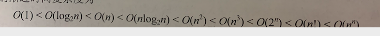

# 数据结构_严版

## 第一章- 绪论

### 1.1 什么是数据结构

计算机解决一个具体问题的步骤：

- **抽象**为一个具体的**数学模型**  -- 本质是分析问题
- **设计**一个解决模型的**算法**
- **编出程序**，测试，知道最终解答。

什么是数据？

- **数据是信息的载体**， 客观**描述事物属性**的数、字符等能被计算机程序识别和处理的**符号集合**。  数据是计算机程序加工的原料。

什么是数据元素， 数据对象。 数据类型？

- **数据元素**是数据的基本单位。 通常作为整体进行考虑和处理。**一个数据元素可以由多个数据项组成。**  数据项是组成数据元素的不可分割的最小单位。  学生记录 就是一个数据元素。由 学号 ， 姓名  性别 等数据项组成。
- **数据对象**是具有**相同性质的数据元素的集合**。是 数据的一个子集。  整数数据对象是集合N={0,±1，±2.。。}
- **数据类型** 是一个值的集合  + 定义在集合上的一组操作的总称。
  - 原子类型  -  值不可再分割，**如c中基本类型、指针。空。** 
  - 结构类型   - 值可以分为若干个 数据类型。如： 数组
  - 抽象数据类型ADT  。描述了数据的逻辑结构 及抽象运算，通常由**数据对象 数据关系 基本操作集**这样的三元组标识。  如： 自定义类 (类属性+ 类方法)

什么是数据结构？

数据结构 是相关之间存在的一种 或多种特定关系的数据元素的集合。(多个数据元素+ 其之间形成的关系(**结构**))。  数据结构包括三方面的内容：

- **逻辑结构** 。指 数据之间的逻辑关系， 和存储结构无关，是独立于计算机的。

  - 线性结构  - 一对一的关系 常见的有栈 、队列、 串、数组
  - 非线性结构(集合(同属于一个集合，别无其他)      数(存在一对多)  图((存在多对多)) )   集合 一叉树、二叉树、有向图、无向图等。

  

- **存储结构**  指数据结构在计算机中的标识，又称为映像。 也称为物理结构。**包含了数据元素的标识 和关系的标识。**   数据的存储结构是用编程实现的逻辑结构，依赖于计算机语言。  主要有：

  - 顺序存储  。逻辑上相近，物理上也相近。   优点 ： 可以随机读取，占用最少存储空间 缺点： 智能使用相邻的内存，  可能产生较多碎片。
  - 链式存储   不要求逻辑相邻的物理也相邻，通过指针来标识逻辑关系 优点： 不会出现碎片， 充分利用存储。 缺点： 指针占用了存储空间。 且只能顺序读取。

  - 索引存储  。 存入数据的时候 附加索引表。 优点： 查询速度快  缺点： 索引占用空间， 数据变动需要修改索引，花费时间。
  - 散列存储   根据元素的关键字直接算出存储地址。 又称为哈希存储。  优点： 增加 删除  查询节点都很快。 缺点： 如果散列函数不好 容易出现存储单元冲突，冲突的解决会增加时间和空间开销。

- **数据的运算**  施加在数据上的运算包括运算的定义 和实现。  定义 是在逻辑结构上。   实现是在存储结构上，指出具体的操作步骤。

补充： 线性表的存储方式实现， 可以用顺序存储 也可以用链式存储实现。 顺序存储下 插入一个元素平均要移动一半的元素。时间复杂度是O(n).  再链式存储下 插入和删除的时间复杂度都是O(1)

### 1.2 算法

算法是 **针对特定问题求解步骤的一种描述**。 它是指令的有限序列。(意思就是代码翻译为机器码 是可以执行结束的)。     算法具有5个重要特征。：(不属于定义部分)

- 有穷性      执行的指令有穷， 每个指令执行的时间有穷。
- 确定性      算法中每条指令必须有明确的含义，对于相同的输入只能得到相同的输出
- 可行性      算法描述的操作可以通过基本运算执行有限次数来实现。
- 输入          算法有0个或者 多个输入。
- 输出          算法有1-多个 输出。输出是与输入有某种特定关系的量。

通常一个好的算法需要考虑达到如下目标：

- 正确性      能够正确解决问题
- 可读性      算法具备良好的可读性，便于理解
- 健壮性     对非法数据能够进行处理，不会产生莫名结果
- 效率和低存储量需求  。效率是指运行的时间，存储量是指执行所需的存储空间。

算法效率的度量：

度量的方式 可以通过 事后统计 、  事前分析估算的方法(主)。  算法效率的度量主要通过时间复杂度和空间复杂度来描述。  同一个算法通过不同的语言实现、不同的编译程序编译 、在不同的计算机上运行，其效率均不同。用绝对的时间单位衡量算法的效率是不合适的。 别开软硬件的影响， 可以认为一个特定算法的工作量的大小，只依赖于问题的规模(通常用整数n标识)，或者说它是问题规模的函数。

**时间复杂度：**

一般情况下，算法中基本操作重复执行的次数是问题规模n的某个函数f(n)。算法的时间量度记做：

**T(n) = O(f(n))**   

表示：随着n的增大，算法执行时间的增长率和f(n)的增长率相同。 称作算法的渐进时间复杂度。 简称时间复杂度。 语句的频度指的是语句重复执行的次数。如以下三个程序段：(常数阶  线性阶 平方阶)

算法的复杂度不仅依赖于规模n,也和输入有关。比如 在数组A中查找给定k值的算法如下：

后续各章中讨论的时间复杂度一般就是说最坏情况下的时间复杂度。除非特别说明。

分析一个程序的时间复杂性时，有两个规则：

   

常见的渐进时间复杂度为：

计算复杂度常用公式：

**真题分析：**

题目1：

解题思路： 设运行次数为k     ix2k  = n       则：  复杂度为 D  log2n

题目2：

阶梯思路： 设运行次数为t.   。 外层循环时间复杂度为 log2n    内层循环时间复杂度为 n   根据循环嵌套法得选择C 变形题：

不能用乘法原则了。 

题目3：

解题思路：设运行次数为t。  则： 1+2+3 。。。+t <n 根据公式 k（k+1）/2 <n   则复杂度为  B

题目4：

典型的冒泡排序 D 

题目5：

判断出不能用乘法原则。   其运行次数为k . k= 2+2x2  + 2x3 + .. + 2xn = n(n+1)

题目6：--递归函数的时间复杂度

## 第二章 线性表