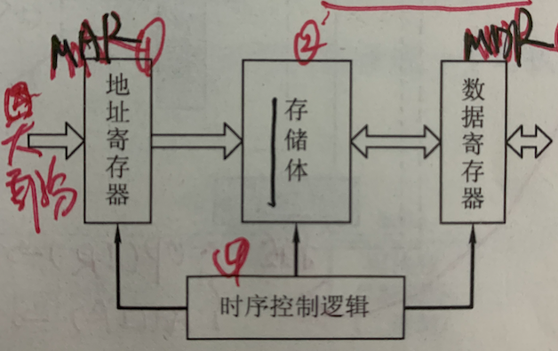

# 计算机组成原理

## 第一章 计算机系统概论

考纲内容：

- 计算机层次结构  计算机基本组成；计算机软件的分类； 计算机的工作过程。
- 计算机的性能指标。吞吐量、响应时间、CPU时钟周期、主频、CPI、MIPS、MFIPS  GFLOPS  TFLOPS PFLOPS 等。

**计算机发展历程：**

电子管    晶体管   中小规模集成电路  大规模集成电路

计算机元件的更新换代：

- 摩尔定律 每隔18个月。晶体管数目增加一倍，性能提升一倍。
- 微处理器从8位 16位  到32位  到64位。  --- 说的 是机器字长，计算机进行一次整数运算所能处理的二进制数据的位数。

计算机按照指令和数据流还可以分为：

- 单指令流  单数据流系统。SISD  -传统冯诺依曼体系结构
- 单指令  多数据流。 SIMD      阵列处理器 向量处理器 等。
- 多指令 单数据流   实际中不存在
- 多指令 多数据流    多处理器 和  多 计算机系统。

**对于通常的计算机系统：**

用户编写的高级语言程序----》翻译为机器语言程序  ---》 执行 ----》结果。

根据高级语言的种类，又可以分为三种：

汇编语言：汇编语言----汇编器------》机器语言 

高级语言：高级语言- 翻译--》 ---汇编器--》 机器语言

就翻译而言，可以分为 编译(fortran  pascal  c++  c) 和 解释(python java等)。 basic既有编译的 也有 解释的。

 备注： 目前所有计算机为什么都用二进制来表示信息， 因为二进制只有1和0， 刚好对应高低点评，实现比较方便可靠，因此其主要由物理器件决定。

**计算机系统的组成：**

硬件系统 + 软件系统 共同构成一个完整的计算机系统。计算机性能的好坏，很大程度上由软件的效率和作用表征。软件性能发挥离不开硬件支持， 一个功能既可以由软件实现 也可以用硬件实现。 且一般硬件效率较高。

**计算机硬件的组成：**

冯诺依曼提出了存储程序的概念，以此概念为基础的计算机统称为冯诺依曼机。 其特点如下：

-  运算器、存储器、控制器、输入设备、输出设备 5大部分组成。
- 指令 和 数据以同等地位存储在存储器中。并按照地址寻访。
- 指令 和 数据均是二进制。
- 指令 由 操作码 和地址码构成。 操作码指出操作的类型， 地址码 指出**操作数**的地址。
- 指令 在 存储器内按顺序存放。 通常 指令是顺序执行的，在特定条件下可以根据运算结果/设定条件 改变顺序。

早起的冯诺依曼以运算器为 核心，输入输出设备 通过 运算器 与 存储器传送数据。

现代计算机已发展为以存储器为核心。 IO 尽可能绕过CPU。 直接在I/O设备 和 存储器之间完成，以提高效率。不过其仍然遵循其设计思想。

- **输出设备**   - 鼠标 扫描仪 摄像机等。

- **输入设备**   打印机 显示器等 

- **存储器**  其用来存放程序和数据。

  - 主存储器 （主存  内存储器）--cpu可以直接访问 ，其按**存储单元地址** 进行存取，称为**按地址存取**。(相联存储器 按照内容访问)，  其有很多存储单元，每个存储单元可以存放一批二进制信息，**称为存储字**，这批二进制的长度 就是**存储字长**(一般为8bit或8bit的偶数倍)。

    - 地址寄存器-MAR 用于寻址。 其位数对应存储单元的个数。 10位，有210  1024个存储单元，记做1K。MAR长度 和PC的长度相等。
    - 存储体 
    - 数据寄存器-MDR   **其和存储字长相同。**
    - 时序控制逻辑 -用来产生存储器操作所需的时序信号

    

  - 辅助存储器 (辅存  外部存储器) - 必须先读入主存 才能访问。

- **运算器**   是计算机的执行部件 
  - 算术逻辑单元ALU是其核心部件,如下三个是其必须的
    - 累加器 ACC
    - 乘商寄存器 MQ
    - 操作数寄存器 X
  - 程序状态寄存器 psw  存放状态信息，比如是否溢出，进位，错位。

- **控制器**  其是计算机的指挥中心。
  - PC
  - IR
  - CU

**备注：MAR MDR虽然属于存储器，但是在现代CPU中，其是MAR MDR 运算器  控制器 是存在于CPU中的。**

## 第二章  计算机的发展及应用