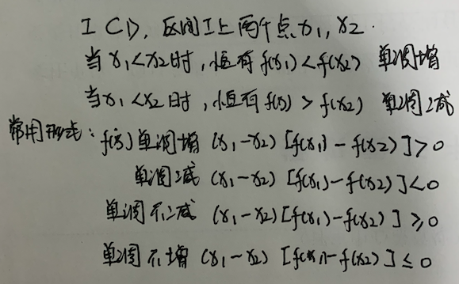

## 高等数学预备知识

### 函数的概念与特性

- 

- 

- 

- 四大特性

  - 区间有界性

  - 区间单调性

    

  - 奇偶性    恒有 f(-x) = f(x) 偶函数。 关于y轴对称   f(-x)= - f(x) 奇函数。  关于原点对称。

  

  - 周期性   存在一个正整数T，使得对于x∈D，x±T∈D ，且f(x+T) = f(x)， 称f(x)为周期函数。 T为周期。

  **重要结论：**

  1. f(x)可导的偶函数， f‘(x)是奇函数
  2. f(x)可导的奇函数，f'(x)是偶函数
  3. 如果f(x)是可导的周期T函数， f'(x) 也是周期为T的函数。
  4. 一切连续的奇函数的原函数都是偶函数。
  5. 一切连续的偶函数的原函数只有一个是奇函数。
  
  

### 函数的图像：

**直角坐标系下的图像**：

**常数函数**：

**幂函数**：

常用的如下
$$
y=x ,y=x^2, y=\sqrt x, y=x^3, y=\sqrt[3]{x},y=\frac{1}{x}
$$

**指数函数**：
$$
y=a^x (a>0,a≠1)， y=e^x 
$$

备注： 其定义域为(-♾，+♾) ，值域 (0,+♾)

**对数函数**：
$$
y=\log_ax（a>0,a≠1） ， 其是 y=e^x的反函数
$$

备注： 常用对数函数 $ y=\ln x  $ 自然对数。$ \ln x=\log_{e}{x}, e=2.71828...   $  

$ \log_{a}{1}=0 ; log_{a}{a}=1 ; \ln1=0; \ln e=1 $

$ x= e^{ln x}  （x>0） $    $ u^v=e^{ln{u^v}} = e^{vlnu}  （u大于0） $

**三角函数**：

sin cos:

y=sinx是奇函数  y=cos x是偶函数 ,其都是以2π位周期的周期函数。  cos相当于sin 左移了π/2.

tan  cot:

反三角函数：

图像的变换：

